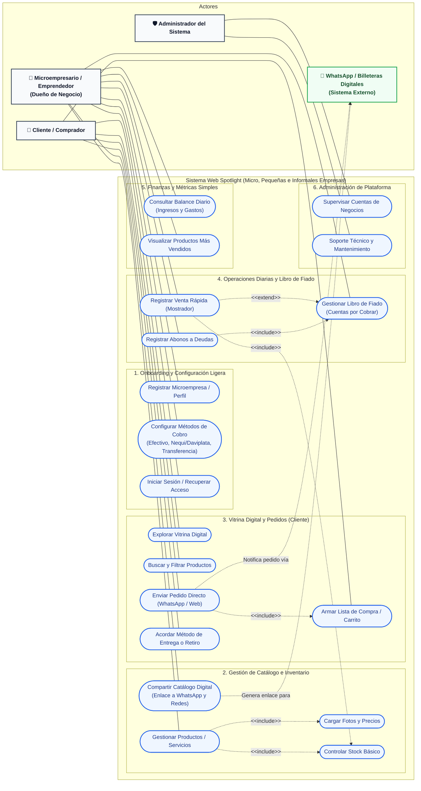

# Diagrama de Casos de Uso - Spotlight
Plataforma Web para Micro, Pequeñas e Informales Empresas

Este documento contiene el diagrama UML de casos de uso para **Spotlight**, optimizado para que **GitHub** lo renderice de forma nativa e interactiva mediante **Mermaid**.

---

## 1. Diagrama de Casos de Uso (Mermaid)

> **Nota para GitHub**: GitHub interpreta automáticamente el bloque ````mermaid```` que se muestra a continuación:



---

## 2. Descripción de Actores

| Actor | Tipo | Descripción |
|---|---|---|
| **Microempresario / Emprendedor** | Humano (Primario) | Dueño o encargado de la micro o pequeña empresa (formal o informal). Administra su catálogo, registra ventas de mostrador, controla su fiado y consulta ingresos diarios sin complejidades contables. |
| **Cliente / Comprador** | Humano (Primario) | Persona que accede a la vitrina web del micronegocio, revisa productos/precios y realiza pedidos de manera rápida y directa. |
| **Administrador del Sistema** | Humano (Secundario) | Responsable del soporte, mantenimiento y gestión global de las microempresas registradas en la plataforma Spotlight. |
| **WhatsApp / Billeteras Digitales** | Sistema Externo | Canales externos de interacción donde se concretan pedidos (chats de WhatsApp) y pagos electrónicos directos (Nequi, Daviplata, transferencias). |

---

## 3. Matriz de Casos de Uso por Módulo

### Módulo 1: Onboarding y Configuración Ligera
* **Registrar Microempresa / Perfil:** Permite a dueños de negocios informales y pequeños crear su perfil en minutos, sin requisitos tributarios complejos.
* **Configurar Métodos de Cobro:** Definición de números para billeteras digitales (Nequi, Daviplata, etc.), efectivo y transferencias.
* **Iniciar Sesión / Recuperar Acceso:** Mecanismo de autenticación simplificado.

### Módulo 2: Catálogo y Productos
* **Gestionar Productos / Servicios:** Alta, modificación y baja de ítems ofrecidos.
* **Cargar Fotos y Precios:** Adición visual atractiva para compradores (`<<include>>`).
* **Controlar Stock Básico:** Monitoreo elemental de inventario para evitar vender ítems agotados (`<<include>>`).
* **Compartir Catálogo Digital:** Genera enlaces optimizados para difundir la vitrina por WhatsApp, Instagram o Facebook.

### Módulo 3: Vitrina Digital y Pedidos (Cliente)
* **Explorar Vitrina Digital:** Visualización ágil de productos optimizada para dispositivos móviles.
* **Buscar y Filtrar Productos:** Búsqueda rápida por nombre o categoría.
* **Armar Lista de Compra / Carrito:** Selección de cantidades y productos de interés.
* **Enviar Pedido Directo:** Genera la orden y envía el resumen automáticamente al WhatsApp del negocio o por la web (`<<include>>` con Carrito).
* **Acordar Método de Entrega o Retiro:** Coordinación de entrega a domicilio o recogida en el local.

### Módulo 4: Operaciones Diarias y Libro de Fiado
* **Registrar Venta Rápida (Mostrador):** Registro en segundos de ventas presenciales con actualización inmediata de stock.
* **Gestionar Libro de Fiado:** Registro de clientes de confianza con cuentas pendientes por cobrar (`<<extend>>` de Venta Rápida cuando no pagan de contado).
* **Registrar Abonos a Deudas:** Registro de pagos parciales o totales de clientes deudores (`<<include>>` con Libro de Fiado).

### Módulo 5: Finanzas y Métricas Simples
* **Consultar Balance Diario:** Vista resumida de ingresos y gastos del día en lenguaje directo y claro.
* **Visualizar Productos Más Vendidos:** Identificación de los artículos con mayor rotación.

### Módulo 6: Administración de Plataforma
* **Supervisar Cuentas de Negocios:** Monitoreo del estado de las cuentas activas.
* **Soporte Técnico y Mantenimiento:** Resolución de dudas y estabilidad de la plataforma.
